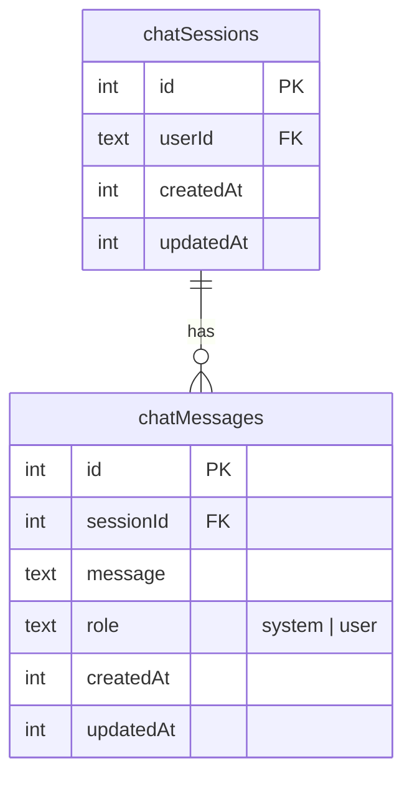
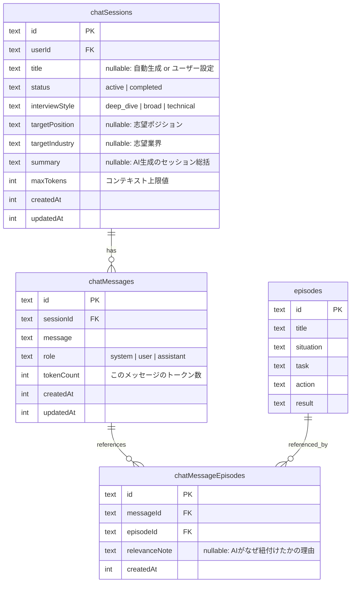
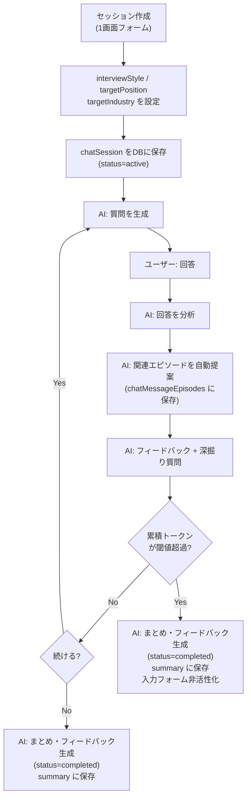

# 面接練習機能のデータモデル設計

## 現状のスキーマ

現在の `src/db/chat.ts` は最小限の構造で、面接練習に必要なメタデータが不足している。

## 提案するスキーマ

## 各テーブルの変更点と理由

### 1. chatSessions の拡張

セッション作成画面（1画面フォーム）でユーザーが事前にすべて設定してから面接練習を開始する。

- **`id`**: `integer` (auto-increment) -> **`text`** (UUID) に変更。他テーブル（episodes, tags等）と統一
- **`title`** (nullable text): セッション一覧で何の練習だったか一目でわかる。ユーザーが任意で設定、未設定なら最初の質問からAIが自動生成
- **`status`** (enum: `active` / `completed`): 進行中と完了済みの区別
- **`interviewStyle`** (enum: `deep_dive` / `broad` / `technical`): 面接官の質問スタイル
  - `deep_dive`: 1つのエピソードを深く掘り下げる
  - `broad`: 幅広いテーマを浅く聞く
  - `technical`: 技術的な詳細に踏み込む
- **`targetPosition`** (nullable text): 志望ポジション
- **`targetIndustry`** (nullable text): 志望業界
- **`summary`** (nullable text): セッション完了後のAI生成フィードバック。ユーザー終了・コンテキスト上限終了の両方で生成
- **`maxTokens`** (integer): コンテキストウィンドウ上限

### 2. chatMessages の修正

- **`id`**: `integer` -> **`text`** に変更（他テーブルとの統一）
- **`role`**: `["system", "user"]` -> **`["system", "user", "assistant"]`** に拡張
- **`tokenCount`** (integer): メッセージごとのトークン数

### 3. chatMessageEpisodes（新規テーブル）

エピソード紐付けをメッセージ単位で行う中間テーブル。

### 4. Relations の追加

- `chatSessionsRelations`: user(one), chatMessages(many)
- `chatMessagesRelations`: chatSession(one), chatMessageEpisodes(many)
- `chatMessageEpisodesRelations`: chatMessage(one), episode(one)

## UX上のデータフロー

